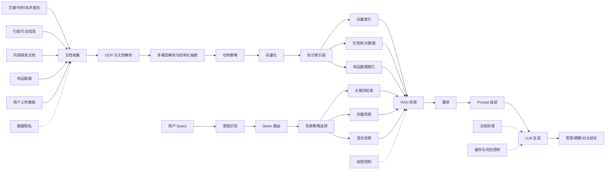

# GLASS-RAG 产品详细说明文档

## 1. 文档说明

本文档基于图片 [GLASS_RAG.jpg](F:\2026\简历AI优化\GLASS_RAG.jpg) 中的内容进行整理与补全，目标是将原始草图还原为一份可用于产品讨论、方案评审和研发对齐的产品说明文档。

说明：

- 图中核心语义较明确，包含 `Glass-RAG`、`RAG设计图`、`文档收集`、`OCR/解析/多模态`、`切块/向量化`、`Query意图识别`、`Qwen路由`、`RAG检索重排`、`数据上传`、`文献/专利/技术报告`、`行规/行业信息`、`数据隐私`、`权限/合规处理` 等要素。
- 个别文字在 OCR 识别中存在噪声，本文档已按上下文进行合理推断与规范化表达。

## 2. 产品概述

### 2.1 产品名称

`GLASS-RAG`

### 2.2 产品定位

面向玻璃材料研发、样品开发与技术支持场景的知识增强问答与资料检索平台。产品通过 RAG（Retrieval-Augmented Generation，检索增强生成）架构，将企业内部资料、行业公开资料、样品数据和研发文档统一接入，实现“能查、能问、能总结、能追溯”的智能知识服务能力。

### 2.3 产品要解决的问题

根据草图内容，产品主要解决以下问题：

- 开发资料查找困难，人工定位资料耗时。
- 样品开发数据难以留存、流转和复用。
- 文档、专利、技术报告、行业资料分散，无法统一检索。
- 多来源资料格式不统一，存在图片、扫描件、表格和文本混杂的问题。
- 整体研发协作效率低，知识复用能力弱。

### 2.4 目标价值

- 提升研发、工艺、质量、销售支持等角色获取资料的效率。
- 沉淀玻璃材料领域的企业知识资产。
- 降低重复试验、重复检索和重复沟通成本。
- 支撑样品开发、材料选型、问题定位和技术答疑等业务场景。

## 3. 用户角色与典型场景

### 3.1 目标用户

- 材料研发工程师
- 样品开发工程师
- 工艺工程师
- 技术支持/售前人员
- 知识管理或数字化平台主管

### 3.2 典型使用场景

- 查询某类玻璃材料的配方、性能、实验记录和历史样品信息。
- 检索与某项研发问题相关的专利、技术报告、行业规范和内部文档。
- 对上传资料进行自动解析，快速抽取关键信息。
- 基于用户问题生成材料对比、方案建议或知识摘要。
- 对研发过程中的历史知识进行复盘和复用。

## 4. 产品目标与范围

### 4.1 核心目标

- 打通玻璃材料研发知识的采集、解析、索引、检索和生成闭环。
- 建立统一的知识底座与问答入口。
- 在保证数据隐私和权限合规的前提下，提高研发查询与决策效率。

### 4.2 产品范围

纳入范围：

- 文档采集与数据上传
- OCR 与多模态解析
- 文档切块与向量化
- RAG 检索、重排与生成
- 查询路由与 Prompt 策略
- 权限、合规与隐私控制

暂不展开：

- LIMS/PLM/ERP 等外部业务系统的深度双向集成
- 复杂实验流程自动编排
- 材料配方自动生成与闭环实验控制

## 5. 产品架构图

## 6. 核心功能设计

### 6.1 数据接入与采集

产品需支持多源知识接入：

- 文献、专利、技术报告
- 行规与行业信息
- 内部研发资料
- 样品开发相关数据
- 用户即时上传的文件

功能要求：

- 支持批量导入和单文件上传。
- 支持 PDF、Word、图片、表格等常见格式。
- 支持为资料补充标签、来源、时间、业务域、保密等级等元数据。

### 6.2 文档解析与多模态处理

根据草图中的 `OCR`、`解析`、`多模态` 信息，系统应具备以下能力：

- 对扫描件、图片文档进行 OCR 识别。
- 对文本、图片、表格、图文混排内容进行统一解析。
- 对章节、标题、段落、表格字段进行结构化抽取。
- 对文档中的材料名称、配方、参数、测试结果、工艺步骤等实体进行识别。

### 6.3 切块与知识索引

草图中明确提到 `切块策略`、`向量化`，说明系统需要将长文档转化为可检索的知识片段。

功能要求：

- 支持按语义、章节、标题层级进行切块。
- 对表格、图文块、实验记录等特殊内容采用差异化切块策略。
- 对切块后的内容生成向量表示。
- 建立文档库、元数据索引和向量索引。

### 6.4 Query 理解与路由

草图中包含 `Query/意图识别` 与 `Qwen路由`，说明系统应先理解问题，再决定调用路径。

功能要求：

- 识别用户问题属于资料查找、样品查询、知识问答、总结归纳、对比分析等哪一类任务。
- 基于意图选择适合的检索方式、Prompt 模板和模型能力。
- 对多轮问题保留上下文，并结合历史会话做问答连续性处理。

### 6.5 检索与重排

草图中包含 `关键词`、`向量`、`混合`、`RAG检索重排` 等关键词。

功能要求：

- 支持关键词检索。
- 支持向量检索。
- 支持混合检索。
- 对召回结果进行重排，提高最终上下文质量。
- 对检索结果展示来源、片段、时间和可信度。

### 6.6 生成与回答

草图中指出：

- `LLM 需支持多模态输入`
- `生成的 LLM 应由意图结合 Prompt 生成不同结果`

因此生成层要求：

- 基于意图调用不同 Prompt 模板。
- 支持问答、摘要、对比、归纳、建议等多种输出模式。
- 在回答中引用知识来源，避免“无依据生成”。
- 对高风险问题增加“证据不足”提示。

### 6.7 权限、隐私与合规

草图明确列出 `数据隐私`、`权限`、`合规处理`、`风险` 等约束。

功能要求：

- 按用户、部门、项目、文档密级做权限隔离。
- 对内部数据、样品数据和研发资料进行分级保护。
- 对访问、检索、下载、问答行为保留审计日志。
- 对生成回答增加合规过滤与敏感信息拦截。

## 7. AI 技术提取与技术方案说明

### 7.1 从草图中识别出的 AI 技术要素

- `OCR`：用于图片、扫描件、纸质资料电子化。
- `多模态解析`：用于处理图文混排、图片、表格等复杂资料。
- `意图识别`：对 Query 做任务分类与分流。
- `Qwen 路由`：用于模型或能力路由。
- `切块策略`：对长文档做语义切分。
- `向量化`：将文档片段转为向量索引。
- `RAG 检索重排`：检索增强生成的核心链路。
- `Prompt 生成策略`：根据意图生成不同回答模板。

### 7.2 推荐的技术分层

#### 7.2.1 采集层

- 文件上传
- 外部资料抓取或导入
- 元数据登记

#### 7.2.2 解析层

- OCR 引擎
- 文档解析器
- 多模态结构化抽取
- 实体识别与字段抽取

#### 7.2.3 索引层

- 文档主库
- 元数据索引
- 向量索引
- 样品数据索引

#### 7.2.4 检索层

- 关键词检索
- 向量检索
- 混合检索
- 重排模型

#### 7.2.5 生成层

- 意图识别
- 模型路由
- Prompt 编排
- LLM 生成
- 结果后处理

#### 7.2.6 治理层

- 权限控制
- 隐私脱敏
- 合规审查
- 日志与监控

### 7.3 关键技术策略

#### 7.3.1 切块策略

图中明确强调切块策略，因此这是效果成败的关键。

建议：

- 按章节标题、语义边界进行基础切块。
- 对专利、技术报告、实验记录分别配置专属切块模板。
- 对表格数据不要粗暴按固定字数切块，应保留行列关系。
- 对图片及图表需保存原文说明与位置关联。

#### 7.3.2 检索策略

图中明确给出 `关键词、向量、混合` 三种方式。

建议：

- 精确术语、标准号、专利号优先关键词检索。
- 语义问答与相似问题优先向量检索。
- 复杂研发问题采用混合检索，以提升召回完整性。
- 对召回结果进行 cross-encoder 或 LLM rerank 重排。

#### 7.3.3 模型策略

图中指出 `LLM 需支持多模态输入` 和 `意图结合 Prompt 生成不同结果`。

建议：

- 采用支持文本和图片联合理解的模型。
- 基于意图区分“检索问答”“对比分析”“知识总结”“样品查询”等模式。
- 对不同任务配置不同的 Prompt 模板和输出格式。

## 8. 关键业务流程

### 8.1 知识入库流程

1. 用户上传或系统导入资料。
2. 系统完成 OCR 与文档解析。
3. 系统进行结构化抽取和元数据补全。
4. 系统根据文档类型执行切块。
5. 系统完成向量化并写入索引。
6. 文档进入可检索状态。

### 8.2 问答流程

1. 用户提交 Query。
2. 系统做意图识别。
3. 路由层选择检索策略与模型策略。
4. 系统从知识库召回候选片段。
5. 重排后选出高相关上下文。
6. Prompt 组装并调用 LLM 生成。
7. 返回带来源依据的回答。

## 9. 产品经理评估策略

本节是从草图内容延伸出的产品落地评估框架，重点用于判断 GLASS-RAG 是否“可上线、可扩展、可持续优化”。

### 9.1 评估目标

- 是否真正降低资料查找时间。
- 是否提升研发知识复用率。
- 是否能在可控风险下稳定给出高质量回答。
- 是否适配玻璃材料行业的专业语境与数据特点。

### 9.2 评估维度

#### 9.2.1 数据维度

- 文档覆盖率：关键资料是否已接入。
- 解析成功率：OCR 与文档解析是否稳定。
- 结构化完整率：标题、表格、字段、实体抽取是否完整。
- 更新时效性：新资料是否能及时入库。

#### 9.2.2 检索维度

- Top-K 召回率
- 检索准确率
- 重排后相关性提升幅度
- 不同检索策略下的效果差异

#### 9.2.3 生成维度

- 回答准确性
- 引用充分性
- 幻觉率
- 输出稳定性
- 对比/总结类任务的结构化程度

#### 9.2.4 业务维度

- 单次查询平均耗时下降比例
- 研发人员资料查找时长下降比例
- 历史知识复用率
- 样品开发问题闭环效率
- 用户满意度与复用频次

#### 9.2.5 风险维度

- 敏感信息泄露风险
- 越权访问风险
- 模型误答导致的业务误判风险
- 行业资料版权与合规风险

### 9.3 评估方法

#### 9.3.1 离线评测

- 建立标准问答集、标准资料集、标准样品问题集。
- 对召回结果进行人工标注。
- 按问答、摘要、对比、样品查询等任务分场景评测。

#### 9.3.2 在线评测

- 记录用户查询日志、点击日志、追问日志。
- 统计是否命中有效资料来源。
- 观察用户是否复制、收藏、继续复问。
- 跟踪失败问题并反哺知识库与 Prompt。

#### 9.3.3 专家评审

- 邀请材料研发专家、工艺专家对输出进行打分。
- 重点评审事实性、专业性、可执行性和风险可控性。

### 9.4 推荐指标体系

#### 9.4.1 基础指标

- OCR 成功率
- 文档解析成功率
- 入库时延
- 检索响应时延
- 生成响应时延

#### 9.4.2 效果指标

- Recall@K
- MRR / nDCG
- Answer Accuracy
- Citation Precision
- Hallucination Rate

#### 9.4.3 业务指标

- 平均查找时长下降
- 有效问答占比
- 人均使用频次
- 专家认可度
- 研发资料复用次数

### 9.5 产品经理重点关注的判断标准

- 如果 OCR 与解析质量不稳定，后续检索和生成效果一定不稳。
- 如果切块策略不适配专利、报告和样品记录，召回质量会明显下降。
- 如果没有做意图识别和路由，不同问题会共用同一套生成策略，答案质量会波动。
- 如果缺少权限和合规治理，产品无法进入真实研发场景。
- 如果不做来源展示和证据引用，用户很难真正信任系统。

## 10. 版本迭代建议

### 10.1 第一阶段

- 打通上传、解析、切块、向量化、检索、问答主链路。
- 建立玻璃材料知识库最小可用版本。

### 10.2 第二阶段

- 补齐样品数据索引与对比分析能力。
- 增强多模态解析、图表理解和结构化抽取。
- 建立专家反馈闭环。

### 10.3 第三阶段

- 接入企业内部系统。
- 强化权限与审计。
- 提供场景化工作台，如“样品分析助手”“研发资料助手”“行业情报助手”。

## 11. 风险与约束

- OCR 质量受扫描清晰度和版式影响较大。
- 行业文档格式复杂，结构化抽取成本较高。
- 样品数据往往存在口径不一、字段不全的问题。
- 私有数据接入必须解决密级、权限、审计和合规问题。
- 如果模型未做领域适配，专业问答准确率可能不足。

## 12. 总结

`GLASS-RAG` 的本质不是一个通用聊天机器人，而是一个面向玻璃材料研发知识管理与智能问答的行业知识系统。其核心价值在于：

- 将分散资料沉淀为可复用知识资产。
- 通过 OCR、多模态解析、切块、向量化、RAG 检索重排和意图驱动生成，建立从“资料”到“答案”的闭环。
- 在产品层面同时兼顾效果、效率和合规，最终服务真实研发场景。

